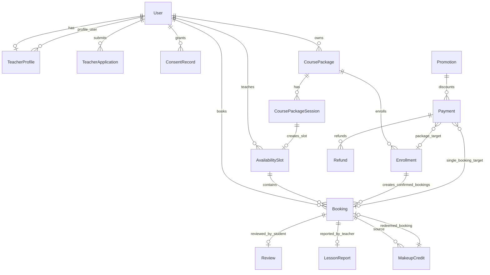
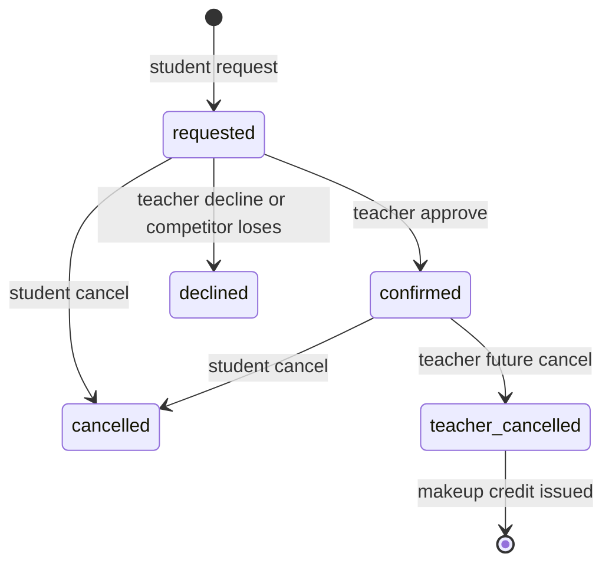
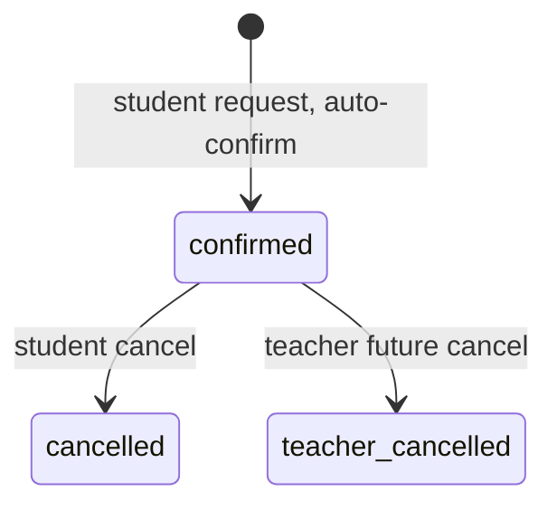
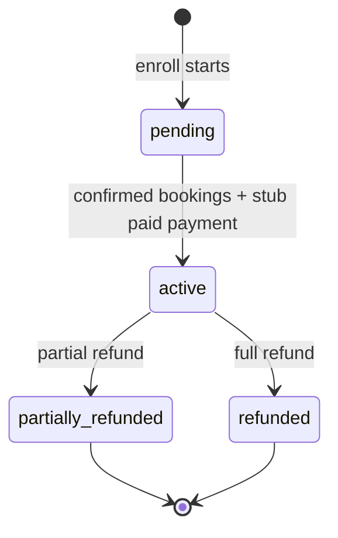

# High Horizon 현재 구현 로직 분석

이 문서는 `/home/kitae/high-horizon/english-online-class`의 현재 코드 기준으로 실제 구현된 로직을 정리한 Obsidian용 운영/개발 참고 문서다. 제품 설명이나 계획이 아니라 코드에서 확인되는 상태만 기준으로 작성했다. `.env`류 비밀 파일은 지침상 열람하지 않았다.

## 1. 한 줄 요약

High Horizon은 Django 5.1 기반 온라인 IELTS 영어 튜터링 서버이며, 현재 구현은 Google-only 로그인, 로그인 후 동의 게이트, 강사 프로필/검색, 1:1 및 그룹 예약, Google Calendar/Meet 연동 스캐폴드, 수업 리포트/후기, 코스 패키지와 부분 환불, 결제 스캐폴드, 공지/법무 페이지로 구성되어 있다.

핵심 근거:

- `apps/server/config/settings.py:36-53` - 설치 앱은 `accounts`, `booking`, `payments`, `courses`, `core`.
- `apps/server/config/urls.py:7-23` - health/admin/OAuth/i18n은 고정 경로, 사용자 페이지는 `/<lang>/...` 아래 i18n 라우팅.
- `apps/server/README.md:3-8` - Django/Postgres/Gunicorn 서버이며 예약과 Google Meet이 중심 흐름.
- `apps/server/README.md:103-118` - 결제는 아직 실결제 전 단계이며 stub 흐름이 준비되어 있음.

## 2. 실행/배포 구조

### 2.1 서버 스택

- Django 5.1.4, Gunicorn, Postgres, WhiteNoise, django-allauth, Google Calendar API, Resend를 사용한다.
- Docker Compose 기준 웹 컨테이너는 `17999:8000`으로 노출되고 Postgres 16 Alpine 컨테이너를 사용한다.
- 컨테이너 시작 시 `entrypoint.sh`가 `python manage.py migrate --noinput` 후 Gunicorn 3 worker로 실행한다.

근거:

- `apps/server/requirements.txt:1-9`
- `apps/server/docker-compose.yml:6-75`
- `apps/server/Dockerfile:1-30`
- `apps/server/entrypoint.sh:1-12`

### 2.2 보안/환경 기본값

- `DEBUG=False`이고 기본 개발용 secret이 그대로이면 `DJANGO_ALLOW_DEV_SECRET=1` 없이는 부팅을 막는다.
- 기본 허용 호스트는 `high-horizon.net`, `localhost`, `127.0.0.1`이다.
- HTTPS 리다이렉트는 Django가 아니라 Nginx Proxy Manager Force SSL에 맡기도록 기본 `SECURE_SSL_REDIRECT=False`다.
- HSTS는 기본 0초로 opt-in이다.
- `.env`는 코드에서 읽지만 이 문서는 비밀 파일을 열람하지 않았다.

근거:

- `apps/server/config/settings.py:9-34`
- `apps/server/config/settings.py:229-244`
- `apps/server/docker-compose.yml:9-43`

## 3. URL/앱 경계

### 3.1 고정 경로

- `/healthz` - DB 접근 없이 `{"status": "ok"}` 반환.
- `/admin/` - Django admin.
- `/accounts/` - allauth OAuth/login 콜백.
- `/i18n/` - Django language switcher.

근거:

- `apps/server/config/urls.py:7-14`
- `apps/server/core/views.py:8-10`

### 3.2 언어 prefix가 붙는 사용자 경로

`i18n_patterns(prefix_default_language=True)` 때문에 사용자-facing 경로는 `/ko/...`, `/en/...` 형태다.

- `booking/` - 예약, 보강권, 후기, 리포트, 진도.
- `courses/` - 과정 패키지, 수강 신청, 환불.
- `payments/` - 단건 예약 결제 stub.
- root accounts/core - 대시보드, 강사 목록/상세, 동의, 랜딩, 법무 페이지.

근거:

- `apps/server/config/urls.py:16-23`
- `apps/server/accounts/urls.py:5-14`
- `apps/server/booking/urls.py:5-24`
- `apps/server/courses/urls.py:5-17`
- `apps/server/payments/urls.py:5-10`
- `apps/server/core/urls.py:6-12`

## 4. 전체 도메인 모델 지도

중요 제약:

- `Payment`는 `booking` 또는 `enrollment` 중 정확히 하나에만 연결되어야 한다.
- `Booking`은 `(slot, student)`가 유일하다.
- `AvailabilitySlot`은 `(teacher, start)`가 유일하고 `booked_count <= capacity`를 DB constraint로 보장한다.
- `Enrollment`는 `(package, student)`가 유일하다.

근거:

- `apps/server/payments/models.py:26-78`
- `apps/server/booking/models.py:55-68`
- `apps/server/booking/models.py:115-121`
- `apps/server/courses/models.py:166-172`

## 5. 인증, 사용자, 동의

### 5.1 사용자 역할

`accounts.User`는 `student`, `teacher`, `staff` 역할을 가진 커스텀 유저 모델이다. 신규 Google 가입은 모델 기본값상 student이고, teacher/staff 권한은 운영자가 승격시키는 구조다.

사용자 필드:

- `role` - 학생/강사/스태프.
- `display_name` - 화면 표시명.
- `timezone` - 기본 `Asia/Seoul`, 강사는 보통 `Asia/Manila`.
- `locale` - 기본 `ko`.

근거:

- `apps/server/accounts/models.py:7-38`
- `apps/server/config/settings.py:110-129`
- `apps/server/accounts/adapters.py:4-14`

### 5.2 Google-only 로그인

- `SOCIALACCOUNT_ONLY=True`로 allauth의 로컬 로그인/가입/비밀번호 흐름은 비활성화되어 있다.
- Google OAuth scope는 `profile`, `email`뿐이다. Calendar scope는 사용자 OAuth가 아니라 중앙 Workspace service account 경계에 있다.
- Google 이름은 가입 시 `display_name`에 채워진다.

근거:

- `apps/server/config/settings.py:122-160`
- `apps/server/accounts/adapters.py:4-14`

### 5.3 로그인 후 동의 게이트

로그인 자체와 동의 수집은 분리되어 있다. `ConsentGateMiddleware`가 인증된 사용자가 필수 동의 최신 버전을 갖지 않으면 `/consent/`로 리다이렉트한다.

필수 동의:

- terms
- privacy
- cross_border

선택 동의:

- marketing

현재 버전은 모두 `v1.0`이다. 동의 기록은 `(user, doc_type)`당 1행이며, `update_or_create`로 최신 결정을 덮어쓴다.

근거:

- `apps/server/accounts/consent.py:1-52`
- `apps/server/accounts/models.py:116-150`
- `apps/server/accounts/middleware.py:114-184`
- `apps/server/accounts/views.py:435-483`

### 5.4 개발용 자동 로그인

`DEV_AUTOLOGIN=True`이고 Google OAuth credential이 없을 때만 동작한다. `?as=teacher` 또는 `?as=student`로 demo role을 바꿀 수 있고, demo user에게 필수 동의를 자동 부여한다. 실제 인증을 우회하므로 운영 데이터에는 켜면 안 되는 개발 편의 기능이다.

근거:

- `apps/server/config/settings.py:145-152`
- `apps/server/accounts/middleware.py:54-112`
- `apps/server/docker-compose.yml:20-23`

### 5.5 시간대/언어 middleware

- 로그인 사용자의 `timezone`을 request 단위로 활성화한다. 비정상 timezone이면 `Asia/Seoul`로 fallback한다.
- `/admin/`은 language cookie가 없으면 영어로 강제한다. 공개 사이트 기본 언어는 한국어다.

근거:

- `apps/server/accounts/middleware.py:14-52`
- `apps/server/config/settings.py:203-216`

## 6. 강사 프로필, 강사 검색, 지원서

### 6.1 강사 프로필

`TeacherProfile`은 강사의 공개 프로필이다. 주요 필드는 headline, bio, 경력, 언어, 국가, 사진 URL, 소개 영상 URL, 외부 프로필 URL, 공개 여부다.

외부 URL은 신뢰 보조 신호로만 쓰며 booking/payment CTA 근처가 아니라 intro card 쪽에 표시되도록 모델 주석과 테스트가 존재한다.

근거:

- `apps/server/accounts/models.py:41-64`
- `apps/server/accounts/forms.py:6-25`
- `apps/server/accounts/tests.py:99-132`

### 6.2 강사 목록 검색

`teacher_list`는 공개된 프로필 중 실제 공급이 있는 강사만 보여준다. 공급은 다음 둘 중 하나다.

- 공개 상태의 `CoursePackage`
- 미래, 미만석, non-course-session 단건 `AvailabilitySlot`

필터:

- `class_type`: 1:1/group
- `recurrence`: weekdays/weekends/mwf/tts
- `tod`: morning/afternoon/evening
- `sort`: rating/new

정렬:

- 기본은 rating/review_count 기준.
- `new`는 프로필 `updated_at` 최신순.

근거:

- `apps/server/accounts/views.py:47-67`
- `apps/server/accounts/views.py:116-297`
- `apps/server/accounts/tests.py:166-280`

### 6.3 강사 상세

강사 상세는 teacher role 사용자만 조회한다. 프로필이 공개되지 않았으면 본인 외에는 404다. 상세에는 다음이 포함된다.

- 공개 패키지 목록
- 미래 단건 slot 최대 20개
- active 보강권 1개
- 평균 평점/후기 5개
- YouTube/Vimeo embed 변환

근거:

- `apps/server/accounts/views.py:178-196`
- `apps/server/accounts/views.py:300-352`

### 6.4 강사 지원/심사

로그인 사용자는 강사 지원서를 제출할 수 있고, pending 신청서가 있으면 중복 제출을 막는다. staff 또는 superuser는 지원서를 승인/반려한다. 승인 시 applicant role을 teacher로 바꾸고 `TeacherProfile`을 생성한다.

근거:

- `apps/server/accounts/models.py:66-113`
- `apps/server/accounts/forms.py:28-44`
- `apps/server/accounts/views.py:32-40`
- `apps/server/accounts/views.py:354-432`

## 7. 예약 로직

### 7.1 예약 모델

`AvailabilitySlot`은 강사가 연 시간대다.

- 1:1 slot: `capacity=1`, 강사 승인 필요.
- 그룹 slot: `capacity>1`, 정원 찰 때까지 자동 확정.
- Calendar/Meet 이벤트는 slot 단위 하나만 가진다.
- `booked_count`는 확정된 booking 수를 나타낸다.

`Booking` 상태:

- `requested`
- `confirmed`
- `declined`
- `cancelled`
- `teacher_cancelled`

`Booking.is_active`는 requested/confirmed만 true다.

근거:

- `apps/server/booking/models.py:10-83`
- `apps/server/booking/models.py:86-128`

### 7.2 slot 생성/삭제

강사는 `/booking/availability/`에서 단건 가용 시간을 만든다. `AvailabilitySlotForm`은 다음을 검증한다.

- 1:1이면 capacity를 1로 강제.
- group이면 capacity 2-4명.
- 종료 시각은 시작보다 뒤.
- 같은 강사의 기존 slot과 시간이 겹치면 거부.

삭제는 미래, course session이 아닌 slot, 예약/요청이 없는 slot만 가능하다.

근거:

- `apps/server/booking/forms.py:16-54`
- `apps/server/booking/views.py:38-73`

### 7.3 학생 예약 요청

`request_booking`은 slot row를 `select_for_update()`로 잠그고 다음을 검사한다.

- course package session slot은 개별 예약 금지.
- 자기 수업 예약 금지.
- 과거 시간 예약 금지.
- 정원 초과 금지.
- active 중복 요청 금지.

1:1:

- booking은 `requested`로 생성/복구.
- 좌석은 아직 차감하지 않음.
- 강사에게 요청 email을 transaction commit 후 보냄.

그룹:

- booking은 즉시 `confirmed`.
- `booked_count += 1`.
- 학생에게 확정 email을 commit 후 보냄.
- calendar sync를 commit 후 예약.

근거:

- `apps/server/booking/services.py:1-14`
- `apps/server/booking/services.py:36-84`
- `apps/server/booking/views.py:310-324`

### 7.4 강사 승인/거절

1:1 승인:

- slot과 booking을 잠근다.
- requested 상태만 승인 가능.
- slot이 full이면 거부.
- booking을 `confirmed`로 바꾸고 `booked_count += 1`.
- full이 되면 경쟁 requested booking들을 `declined`로 일괄 변경.
- 확정/거절 email과 calendar sync는 commit 이후 실행.

거절:

- requested 상태만 `declined`로 바꾼다.
- 학생에게 거절 email을 commit 후 보낸다.

근거:

- `apps/server/booking/services.py:87-133`
- `apps/server/booking/views.py:76-112`

### 7.5 학생 취소

학생 취소는 active booking만 가능하다. confirmed였으면 `booked_count`를 1 줄이고 calendar sync를 예약한다. requested 취소는 좌석 수를 건드리지 않는다.

근거:

- `apps/server/booking/services.py:136-150`
- `apps/server/booking/views.py:426-435`

### 7.6 공개 slot 탐색

`browse_slots`는 모든 강사의 미래, 미만석, non-course-session slot을 모아 calendar UI로 보여준다. 로그인 사용자는 자기 slot이 제외된다. 선택 날짜가 유효하지 않으면 가장 빠른 가능 날짜로 fallback한다.

근거:

- `apps/server/booking/views.py:137-289`

### 7.7 희망 시간 요청

사용자는 열린 slot이 없거나 원하는 시간이 없을 때 `TimeRequest`를 제출할 수 있다. 이 요청은 처리 여부만 저장되고, 자동 slot 생성까지는 구현되어 있지 않다.

근거:

- `apps/server/booking/models.py:218-239`
- `apps/server/booking/forms.py:70-89`
- `apps/server/booking/views.py:292-307`

## 8. Google Calendar/Meet 연동

Calendar/Meet은 per-user OAuth가 아니라 중앙 Workspace service account로 설계되어 있다.

활성 조건:

- `GOOGLE_CALENDAR_ENABLED=True`
- `GOOGLE_SERVICE_ACCOUNT_FILE` 존재
- `GOOGLE_CALENDAR_ORGANIZER` 존재

동작:

- confirmed roster가 없으면 기존 event를 삭제하고 slot의 `google_event_id`, `meet_url`을 비운다.
- event가 이미 있으면 attendee 목록을 DB의 현재 confirmed roster로 덮어쓴다.
- event가 없으면 Meet-enabled event를 만들고 event id/meet URL을 slot에 저장한다.
- Google I/O는 DB transaction 밖에서 수행해 row lock을 오래 잡지 않는다.
- 실패는 caller로 raise하지 않고 `calendar_status=FAILED`로 기록한다.

근거:

- `apps/server/booking/google_calendar.py:1-107`
- `apps/server/booking/services.py:267-341`
- `apps/server/config/settings.py:183-190`

## 9. Email/Resend 알림

예약 이벤트 email은 web/email만 구현되어 있다. Kakao/Alimtalk 같은 채널은 없다.

알림 종류:

- 예약 요청 -> 강사
- 예약 확정 -> 학생
- 예약 거절 -> 학생
- 강사 취소/보강권 지급 -> 학생

전송 실패는 booking state transition을 깨지 않도록 catch/log만 한다. 기본 email backend는 console이고 `RESEND_API_KEY`가 있으면 `core.email.ResendBackend`로 전환된다.

근거:

- `apps/server/booking/notifications.py:1-112`
- `apps/server/core/email.py:1-54`
- `apps/server/config/settings.py:164-181`

## 10. 강사 취소와 보강권

### 10.1 보강권 모델

`MakeupCredit`은 강사 사유로 confirmed future session을 취소할 때 학생에게 발급되는 same-teacher 보강권이다.

상태:

- active
- redeemed
- expired

기본 만료는 생성 후 30일이다. `is_redeemable`은 active이고 `expires_at > now`일 때 true다.

근거:

- `apps/server/booking/models.py:158-215`

### 10.2 강사 취소

강사가 confirmed future booking을 취소하면:

- booking status가 `teacher_cancelled`가 된다.
- slot `booked_count`가 1 감소한다.
- `MakeupCredit`이 생성된다.
- calendar sync와 학생 email 알림이 commit 후 실행된다.

confirmed가 아니거나 이미 시작된 수업이면 거부한다.

근거:

- `apps/server/booking/services.py:192-224`
- `apps/server/booking/views.py:484-497`

### 10.3 보강권 사용

보강권 사용은 다음 조건을 모두 만족해야 한다.

- 보강권이 active이고 만료 전.
- 같은 teacher의 slot.
- 과거 slot 아님.
- slot이 full 아님.
- course package session slot 아님.
- 같은 slot/student active booking 없음.

성공 시 confirmed booking을 만들고 `booked_count += 1`, 보강권은 redeemed가 된다.

근거:

- `apps/server/booking/services.py:227-264`
- `apps/server/booking/views.py:500-513`

## 11. 후기와 수업 리포트

### 11.1 학생 후기

후기는 confirmed booking의 학생 본인만 작성할 수 있고, slot 시작 시간이 지난 뒤에만 가능하다. booking당 review는 하나다. 강사 평균 평점과 후기 수는 `teacher_rating()`에서 aggregate한다.

근거:

- `apps/server/booking/models.py:131-155`
- `apps/server/booking/services.py:153-189`
- `apps/server/booking/views.py:397-423`

### 11.2 강사 수업 리포트

강사는 자신이 담당한 confirmed booking에 대해 리포트를 생성/수정할 수 있다. IELTS band 필드는 0-9 범위이며 0.5 단위만 허용한다.

학생은 `/booking/progress/`에서 리포트와 최신 overall band를 볼 수 있다.

근거:

- `apps/server/booking/models.py:242-288`
- `apps/server/booking/forms.py:6-9`
- `apps/server/booking/forms.py:104-115`
- `apps/server/booking/services.py:344-356`
- `apps/server/booking/views.py:438-481`

## 12. 코스 패키지

### 12.1 패키지 모델/제약

`CoursePackage`는 강사 소유 과정 상품이다.

주요 제약:

- 1:1 패키지는 capacity가 1로 강제된다.
- 그룹 capacity는 4명 초과 불가.
- 회차 수는 최대 29.
- 회당 수업 시간은 50분 고정.
- 총 수업 시간은 30시간 미만.
- 자동 갱신 불가.
- 시작일부터 마지막 수업일까지 30일 미만.
- timezone은 유효한 IANA timezone이어야 한다.

반복 패턴:

- weekdays: 월-금
- weekends: 토-일
- mwf: 월/수/금
- tts: 화/목/토

근거:

- `apps/server/courses/models.py:11-17`
- `apps/server/courses/models.py:20-115`

### 12.2 가격 계산

패키지 가격은 입력받지 않고 platform-wide `PricingConfig`에서 계산한다.

- 기본 1:1 단가: 40,000 KRW/회
- 기본 그룹 단가: 20,000 KRW/회
- 패키지 가격: `session_count * rate_for(class_type)`

근거:

- `apps/server/payments/models.py:184-220`
- `apps/server/courses/services.py:23-36`
- `apps/server/courses/forms.py:15-42`

### 12.3 session/slot 생성

`generate_sessions()`는 패키지의 local date/time과 timezone을 UTC slot으로 변환해 `CoursePackageSession`과 `AvailabilitySlot`을 생성한다.

동작/검증:

- 이미 session이 있으면 idempotent하게 기존 session을 반환한다.
- DST로 존재하지 않는 local time은 거부한다.
- DST로 중복되는 local time도 거부한다.
- 같은 강사의 기존 slot과 시간이 겹치면 거부한다.
- 생성된 slot은 package의 class_type/capacity를 그대로 가진다.

근거:

- `apps/server/courses/services.py:98-163`

### 12.4 패키지 생성/수정/마감/삭제

- 강사는 패키지 생성 시 status를 `OPEN`으로 만들고 즉시 session을 생성한다.
- 수강생이 있는 패키지는 수정/삭제할 수 없다.
- schedule 관련 필드가 바뀌면 생성된 slot/session을 삭제하고 다시 생성한다.
- 마감은 status를 `CLOSED`로 바꿔 공개 신청 대상에서 제외한다.

근거:

- `apps/server/courses/services.py:27-95`
- `apps/server/courses/views.py:32-119`

### 12.5 공개 패키지 목록/신청

공개 목록은 `status=OPEN` 패키지를 start_date/start_time 순으로 보여주며, 로그인 사용자는 자기 패키지를 제외한다.

수강 신청 조건:

- 학생이 자기 패키지에 신청할 수 없음.
- package status가 OPEN이어야 함.
- 중복 enrollment 금지.
- 모든 session/slot이 생성되어 있어야 함.
- session slot 중 과거가 있으면 거부.
- full인 회차가 있으면 거부.
- 이미 같은 학생의 active booking이 있으면 거부.

신청 성공 시:

- `Enrollment(status=PENDING)` 생성.
- 모든 session slot에 confirmed booking 생성.
- 각 slot `booked_count += 1`.
- package promotion 적용.
- `Payment(status=PAID, is_stub=True, provider=TOSS)`가 즉시 생성됨.
- enrollment status가 `ACTIVE`가 됨.

현재 코드상 course package enrollment는 `PAYMENTS_ENABLED`와 별개로 테스트 결제가 즉시 완료되는 흐름이다.

근거:

- `apps/server/courses/views.py:129-155`
- `apps/server/courses/services.py:166-234`

## 13. 결제

### 13.1 Payment 모델

`Payment`는 단건 booking 또는 package enrollment 중 정확히 하나에 연결된다.

상태:

- pending
- paid
- failed
- refunded
- partially_refunded

provider:

- Toss
- Stripe

추가 필드:

- `promotion`
- `amount`
- `base_amount`
- `currency`
- `refunded_amount`
- `provider_ref`
- `checkout_url`
- `is_stub`

근거:

- `apps/server/payments/models.py:11-82`

### 13.2 단건 예약 결제 흐름

`PAYMENTS_ENABLED=False`이면 start payment view는 아무 것도 하지 않고 "준비 중" 메시지 후 내 예약으로 돌아간다.

활성화되어 있으면:

- booking은 요청 사용자 본인의 confirmed booking이어야 한다.
- locale이 `ko`이면 Toss, 그 외는 Stripe provider.
- 이미 paid payment가 있으면 거부.
- provider별 기본 금액에 single promotion을 적용한다.
- provider가 실제 credential을 갖고 있지 않으면 stub checkout URL을 반환한다.
- stub complete endpoint는 `is_stub=True` payment만 settle한다.

근거:

- `apps/server/payments/views.py:15-77`
- `apps/server/payments/services.py:25-65`
- `apps/server/payments/providers.py:25-107`

### 13.3 실결제 미구현 경계

Toss/Stripe 실제 API 호출은 아직 `NotImplementedError`다. credential이 설정되어 provider가 configured 상태가 되면 현재 구현은 real checkout/verify가 없어서 예외를 낸다. README도 TODO(real) 구현을 go-live 조건으로 명시한다.

근거:

- `apps/server/payments/providers.py:55-70`
- `apps/server/payments/providers.py:86-100`
- `apps/server/README.md:103-118`

### 13.4 Promotion

Promotion은 percent/fixed 할인과 all/single/package scope를 지원한다. `best_for()`는 활성 기간/범위에 맞는 promotion 중 최종 금액이 가장 낮은 것을 고른다.

근거:

- `apps/server/payments/models.py:84-150`

## 14. 환불

### 14.1 Refund 모델

`Refund`는 `Payment`에 속하고 선택적으로 `Enrollment`에 연결된다. 환불 basis, consumed session 수, idempotency key, provider ref를 저장한다.

근거:

- `apps/server/payments/models.py:153-181`

### 14.2 환불 견적

`refund_quote()`는 세 방식 중 소비자에게 가장 유리한 금액을 고른다.

- `prorata`: 잔여 회차 비례.
- `academy_table`: 미수강이면 전액, 1/3 미만 수강이면 2/3, 1/2 미만 수강이면 1/2, 그 이상이면 0.
- `ecommerce`: 결제 후 7일 이내이고 소비 회차가 0이면 전액, 아니면 prorata.

소비 회차는 `at + 24시간` 이내의 confirmed booking 수로 계산한다. 즉 이미 지났거나 24시간 안쪽의 확정 수업은 환불 계산상 소비로 본다.

근거:

- `apps/server/courses/services.py:237-292`

### 14.3 환불 실행

`refund_enrollment()`은 `enrollment:{id}:refund:v1` idempotency key를 사용한다. 이미 완료된 환불이 있으면 그대로 반환한다.

실행 시:

- 결제 row를 잠근다.
- 환불 견적과 남은 refundable amount 중 작은 금액을 환불 금액으로 한다.
- `Refund(status=DONE)`을 만든다.
- 학생 본인의 미래 confirmed booking만 cancelled 처리한다.
- 해당 slot들의 `booked_count`를 줄인다.
- calendar sync를 예약한다.
- payment/enrollment 상태를 refunded 또는 partially_refunded로 바꾼다.
- enrollment `cancelled_at`을 기록한다.

근거:

- `apps/server/courses/services.py:295-366`
- `apps/server/courses/views.py:169-192`

## 15. 공지, 랜딩, 법무 페이지

### 15.1 Announcement

공지 노출은 `Announcement.active()`가 단일 판단 지점이다.

노출 조건:

- `is_active=True`
- 시작 시각이 없거나 현재 이전
- 종료 시각이 없거나 현재 이후
- 언어가 비었거나 현재 언어와 일치
- anonymous 사용자는 audience가 all인 공지만 봄

글로벌 banner context processor와 공지 목록 view가 같은 active query를 쓴다.

근거:

- `apps/server/core/models.py:9-80`
- `apps/server/core/context_processors.py:6-16`
- `apps/server/core/views.py:17-23`

### 15.2 법무 페이지

terms/privacy/refund는 템플릿 렌더링만 담당한다. consent gate 예외 경로라 동의 전에도 접근 가능하다.

근거:

- `apps/server/core/views.py:26-37`
- `apps/server/accounts/middleware.py:124-140`
- `apps/server/templates/legal/terms.html`
- `apps/server/templates/legal/privacy.html`
- `apps/server/templates/legal/refund.html`

## 16. Admin 운영 화면

Admin에서 관리되는 핵심 객체:

- User: role/display_name/timezone/locale 포함.
- AvailabilitySlot/Booking/LessonReport/TimeRequest.
- CoursePackage/CoursePackageSession/Enrollment/Refund.
- Payment/PricingConfig/Promotion.
- Announcement.

PricingConfig는 add가 singleton처럼 제한되고 삭제가 금지된다.

근거:

- `apps/server/accounts/admin.py:8-16`
- `apps/server/booking/admin.py:6-37`
- `apps/server/courses/admin.py:6-41`
- `apps/server/payments/admin.py:6-69`
- `apps/server/core/admin.py:6-21`

## 17. 테스트 커버리지 지도

현재 테스트는 다음 로직을 직접 다룬다.

- 계정/강사: 프로필 CRUD, 공개 조건, 외부 URL 표시, 강사 목록 필터/정렬, admin locale, dev autologin.
- 예약: 1:1 요청/승인/경쟁 요청 거절, 그룹 자동 확정, 취소 seat release, email, 리포트, 강사 취소/보강권, 보강권 사용, 후기, course session slot 제외.
- 과정: 가격 계산, session 생성, recurrence, capacity/session/hour/span cap, enrollment, 패키지 관리 view, 환불 견적과 환불 실행.
- 결제: locale별 provider, stub checkout/settle, idempotent settle, provider별 amount/currency, promotion, disabled payment.
- core: 영어 번역/랜딩, Resend backend, Announcement active filter/banner.

근거:

- `apps/server/accounts/tests.py`
- `apps/server/booking/tests.py`
- `apps/server/courses/tests.py`
- `apps/server/payments/tests.py`
- `apps/server/core/tests.py`

## 18. 현재 미구현/주의 경계

코드 기준으로 명확히 남아 있는 경계:

- Toss/Stripe 실결제 API 호출과 검증은 아직 미구현이다. credential을 넣으면 stub 대신 real path로 들어가지만 provider가 `NotImplementedError`를 낸다.
- 결제는 기본 비활성화다. 단건 예약 결제 UI는 `PAYMENTS_ENABLED=True`일 때만 노출/작동한다.
- Course package enrollment는 현재 stub `Payment(PAID)`를 즉시 생성한다. 실결제 gateway를 통과하는 흐름은 아니다.
- Calendar/Meet은 env와 service-account 파일이 모두 있어야만 작동한다. 비활성/미설정이면 booking은 계속 진행되고 `calendar_status=SKIPPED`가 된다.
- 동의 철회 UI는 TODO로 남아 있다. 모델/헬퍼는 철회 row를 표현할 수 있지만 account settings 화면은 없다.
- `TimeRequest`는 접수/처리 flag까지만 있고, 자동으로 slot을 열거나 알림을 보내는 후속 workflow는 코드상 없다.
- 이 문서는 live production 상태나 DB 데이터 상태를 검증하지 않았다. 코드 구현 상태만 정리했다.

근거:

- `apps/server/payments/providers.py:62-70`
- `apps/server/payments/providers.py:93-100`
- `apps/server/payments/views.py:18-20`
- `apps/server/courses/services.py:218-231`
- `apps/server/booking/services.py:278-282`
- `apps/server/accounts/consent.py:51-52`

## 19. 변경 시 파일별 진입점

예약 정책을 바꿀 때:

- `apps/server/booking/models.py`
- `apps/server/booking/services.py`
- `apps/server/booking/forms.py`
- `apps/server/booking/views.py`
- `apps/server/booking/tests.py`

패키지/환불 정책을 바꿀 때:

- `apps/server/courses/models.py`
- `apps/server/courses/services.py`
- `apps/server/courses/forms.py`
- `apps/server/courses/views.py`
- `apps/server/courses/tests.py`
- 필요 시 `apps/server/templates/legal/refund.html`

가격/프로모션/결제 정책을 바꿀 때:

- `apps/server/payments/models.py`
- `apps/server/payments/services.py`
- `apps/server/payments/providers.py`
- `apps/server/payments/views.py`
- `apps/server/payments/tests.py`

로그인/동의/권한 정책을 바꿀 때:

- `apps/server/accounts/models.py`
- `apps/server/accounts/consent.py`
- `apps/server/accounts/middleware.py`
- `apps/server/accounts/views.py`
- `apps/server/accounts/tests.py`

강사 공개/검색/지원 workflow를 바꿀 때:

- `apps/server/accounts/models.py`
- `apps/server/accounts/forms.py`
- `apps/server/accounts/views.py`
- `apps/server/templates/accounts/*`
- `apps/server/accounts/tests.py`

공지/법무/랜딩을 바꿀 때:

- `apps/server/core/models.py`
- `apps/server/core/views.py`
- `apps/server/core/context_processors.py`
- `apps/server/templates/core/*`
- `apps/server/templates/legal/*`
- `apps/server/templates/landing.html`

## 20. 상태 전이 요약

### 20.1 단건 1:1 예약

### 20.2 그룹 예약

### 20.3 코스 패키지 수강

## 21. 운영자가 특히 기억해야 할 점

- 예약 seat count는 서비스 함수의 `select_for_update()`와 DB check constraint에 의존한다. 수동 DB 수정은 `booked_count` 불일치를 만들 수 있다.
- Calendar sync는 booking transaction 뒤에 실행된다. Google 실패가 booking 실패를 의미하지 않는다.
- course package slot은 단건 browse/request/redeem에서 제외된다. 패키지 수강 신청만 그 slot에 booking을 만든다.
- package 환불은 미래 booking만 취소하고 seat를 반환한다. 이미 지났거나 24시간 안쪽인 confirmed 수업은 소비 회차로 계산된다.
- 실결제 go-live 전에는 `payments/providers.py`의 TODO(real)를 먼저 구현해야 한다. env key만 넣는 것은 충분하지 않다.
