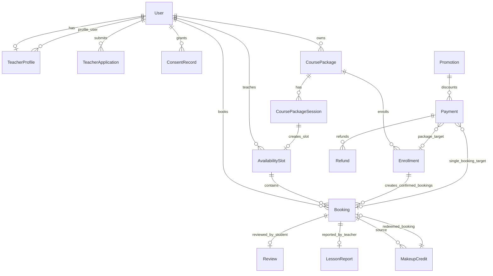
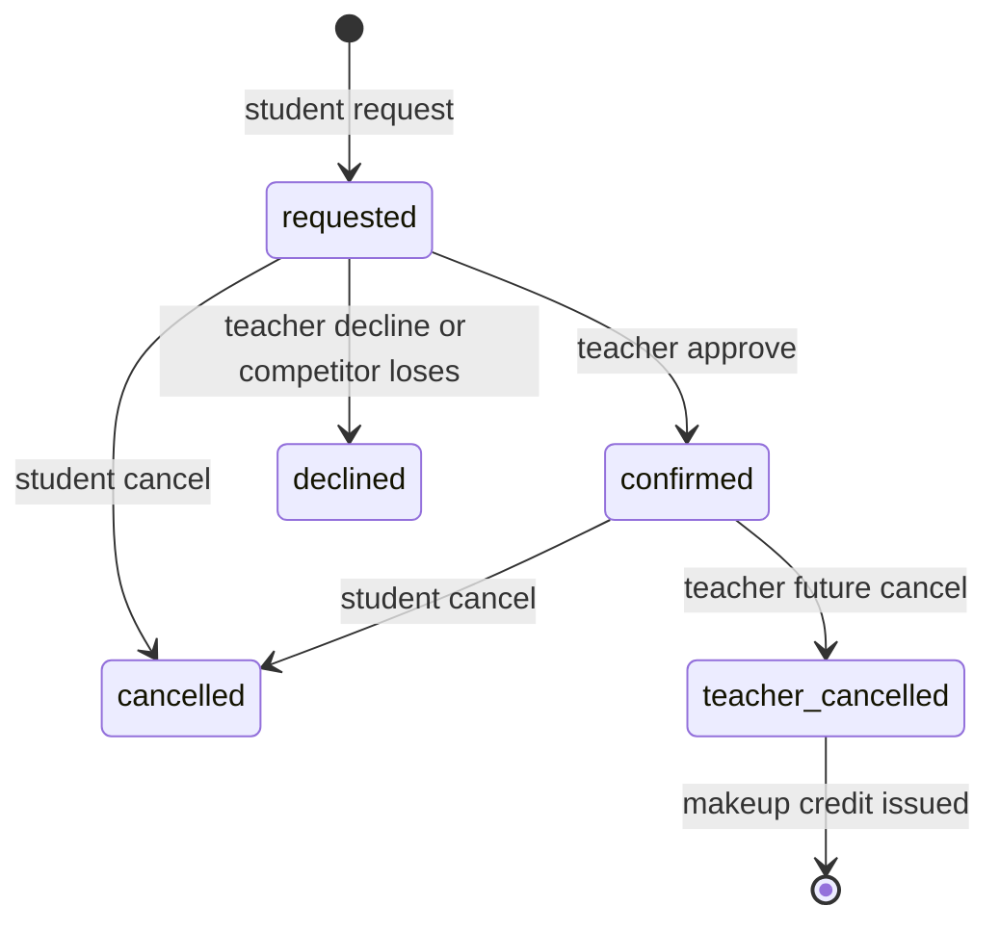
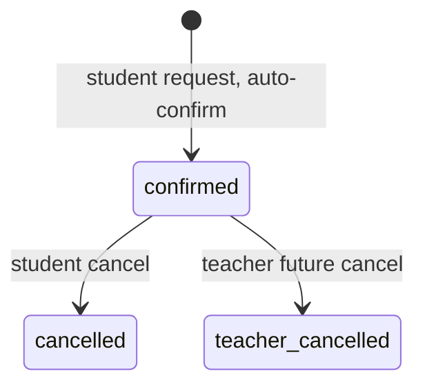
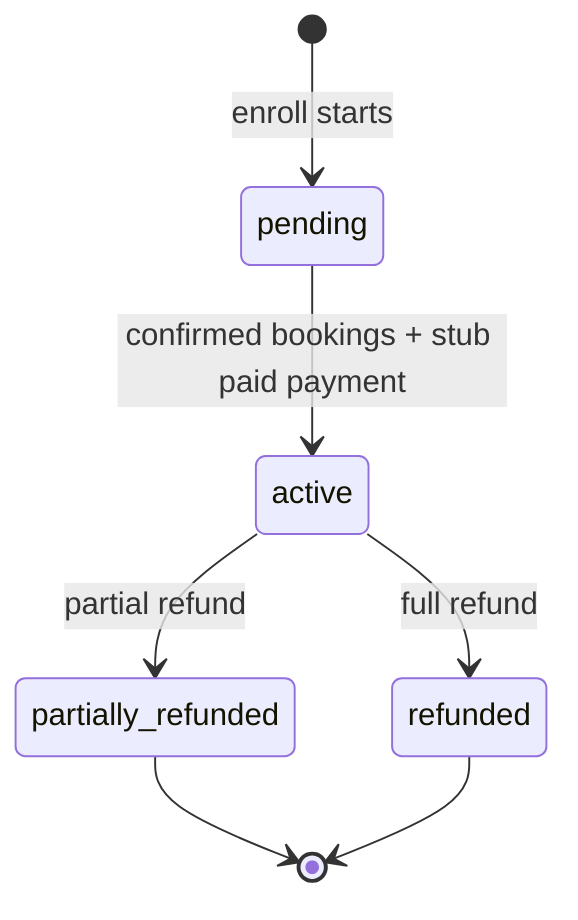

# High Horizon Current Implementation Logic Analysis

This is an Obsidian operations/development reference document summarizing the logic actually implemented in the current code of `/home/kitae/high-horizon/english-online-class`. It is based only on the state confirmed in the code, not on product descriptions or plans. Secret files such as `.env` were not viewed according to instructions.

## 1. One-Line Summary

High Horizon is an online IELTS English tutoring server based on Django 5.1. The current implementation consists of Google-only login, a post-login consent gate, teacher profiles/search, 1:1 and group booking, Google Calendar/Meet integration scaffolding, lesson reports/reviews, course packages and partial refunds, payment scaffolding, announcements, and legal pages.

Key evidence:

- `apps/server/config/settings.py:36-53` - installed apps are `accounts`, `booking`, `payments`, `courses`, `core`.
- `apps/server/config/urls.py:7-23` - health/admin/OAuth/i18n are fixed paths, and user pages are i18n-routed under `/<lang>/...`.
- `apps/server/README.md:3-8` - Django/Postgres/Gunicorn server, with booking and Google Meet as the central flow.
- `apps/server/README.md:103-118` - payment is still before the live-payment stage, and a stub flow is prepared.

## 2. Runtime/Deployment Structure

### 2.1 Server Stack

- Uses Django 5.1.4, Gunicorn, Postgres, WhiteNoise, django-allauth, Google Calendar API, and Resend.
- In Docker Compose, the web container is exposed as `17999:8000` and uses a Postgres 16 Alpine container.
- On container start, `entrypoint.sh` runs `python manage.py migrate --noinput`, then runs Gunicorn with 3 workers.

Evidence:

- `apps/server/requirements.txt:1-9`
- `apps/server/docker-compose.yml:6-75`
- `apps/server/Dockerfile:1-30`
- `apps/server/entrypoint.sh:1-12`

### 2.2 Security/Environment Defaults

- `DEBUG=False`, and if the default development secret remains unchanged, boot is blocked unless `DJANGO_ALLOW_DEV_SECRET=1` is present.
- Default allowed hosts are `high-horizon.net`, `localhost`, and `127.0.0.1`.
- HTTPS redirect is delegated to Nginx Proxy Manager Force SSL rather than Django, so the default `SECURE_SSL_REDIRECT=False`.
- HSTS defaults to 0 seconds and is opt-in.
- `.env` is read by the code, but this document did not inspect secret files.

Evidence:

- `apps/server/config/settings.py:9-34`
- `apps/server/config/settings.py:229-244`
- `apps/server/docker-compose.yml:9-43`

## 3. URL/App Boundaries

### 3.1 Fixed Paths

- `/healthz` - returns `{"status": "ok"}` without DB access.
- `/admin/` - Django admin.
- `/accounts/` - allauth OAuth/login callbacks.
- `/i18n/` - Django language switcher.

Evidence:

- `apps/server/config/urls.py:7-14`
- `apps/server/core/views.py:8-10`

### 3.2 User Paths With Language Prefix

Because of `i18n_patterns(prefix_default_language=True)`, user-facing paths take the `/ko/...` and `/en/...` forms.

- `booking/` - booking, make-up credits, reviews, reports, progress.
- `courses/` - course packages, enrollment, refunds.
- `payments/` - single-booking payment stub.
- root accounts/core - dashboard, teacher list/detail, consent, landing, legal pages.

Evidence:

- `apps/server/config/urls.py:16-23`
- `apps/server/accounts/urls.py:5-14`
- `apps/server/booking/urls.py:5-24`
- `apps/server/courses/urls.py:5-17`
- `apps/server/payments/urls.py:5-10`
- `apps/server/core/urls.py:6-12`

## 4. Full Domain Model Map

Important constraints:

- `Payment` must be connected to exactly one of `booking` or `enrollment`.
- `Booking` is unique on `(slot, student)`.
- `AvailabilitySlot` is unique on `(teacher, start)`, and `booked_count <= capacity` is guaranteed with a DB constraint.
- `Enrollment` is unique on `(package, student)`.

Evidence:

- `apps/server/payments/models.py:26-78`
- `apps/server/booking/models.py:55-68`
- `apps/server/booking/models.py:115-121`
- `apps/server/courses/models.py:166-172`

## 5. Authentication, Users, Consent

### 5.1 User Roles

`accounts.User` is a custom user model with `student`, `teacher`, and `staff` roles. New Google signups are students by the model default, and teacher/staff authority is a structure where operations promotes the user.

User fields:

- `role` - student/teacher/staff.
- `display_name` - screen display name.
- `timezone` - default `Asia/Seoul`; teachers are usually `Asia/Manila`.
- `locale` - default `ko`.

Evidence:

- `apps/server/accounts/models.py:7-38`
- `apps/server/config/settings.py:110-129`
- `apps/server/accounts/adapters.py:4-14`

### 5.2 Google-Only Login

- With `SOCIALACCOUNT_ONLY=True`, allauth's local login/signup/password flow is disabled.
- Google OAuth scope is only `profile`, `email`. Calendar scope is in the central Workspace service account boundary, not user OAuth.
- The Google name is filled into `display_name` on signup.

Evidence:

- `apps/server/config/settings.py:122-160`
- `apps/server/accounts/adapters.py:4-14`

### 5.3 Post-Login Consent Gate

Login itself and consent collection are separated. `ConsentGateMiddleware` redirects authenticated users to `/consent/` if they do not have the latest required consent versions.

Required consent:

- terms
- privacy
- cross_border

Optional consent:

- marketing

The current versions are all `v1.0`. Consent records are one row per `(user, doc_type)`, and the latest decision is overwritten with `update_or_create`.

Evidence:

- `apps/server/accounts/consent.py:1-52`
- `apps/server/accounts/models.py:116-150`
- `apps/server/accounts/middleware.py:114-184`
- `apps/server/accounts/views.py:435-483`

### 5.4 Development Auto-Login

Works only when `DEV_AUTOLOGIN=True` and Google OAuth credentials are absent. The demo role can be changed with `?as=teacher` or `?as=student`, and required consent is automatically granted to the demo user. Because it bypasses real authentication, this is a development convenience feature that must not be enabled for production data.

Evidence:

- `apps/server/config/settings.py:145-152`
- `apps/server/accounts/middleware.py:54-112`
- `apps/server/docker-compose.yml:20-23`

### 5.5 Timezone/Language Middleware

- The logged-in user's `timezone` is activated per request. If the timezone is invalid, it falls back to `Asia/Seoul`.
- `/admin/` is forced to English when there is no language cookie. The default language for the public site is Korean.

Evidence:

- `apps/server/accounts/middleware.py:14-52`
- `apps/server/config/settings.py:203-216`

## 6. Teacher Profile, Teacher Search, Application

### 6.1 Teacher Profile

`TeacherProfile` is the teacher's public profile. Main fields are headline, bio, experience, languages, country, photo URL, intro video URL, external profile URL, and public visibility.

External URLs are used only as supporting trust signals, and model comments and tests exist so they are displayed near the intro card rather than near booking/payment CTAs.

Evidence:

- `apps/server/accounts/models.py:41-64`
- `apps/server/accounts/forms.py:6-25`
- `apps/server/accounts/tests.py:99-132`

### 6.2 Teacher List Search

`teacher_list` shows only teachers with public profiles and actual supply. Supply is one of the following.

- A public `CoursePackage`
- A future, not-full, non-course-session single `AvailabilitySlot`

Filters:

- `class_type`: 1:1/group
- `recurrence`: weekdays/weekends/mwf/tts
- `tod`: morning/afternoon/evening
- `sort`: rating/new

Sorting:

- Default is by rating/review_count.
- `new` is latest profile `updated_at` first.

Evidence:

- `apps/server/accounts/views.py:47-67`
- `apps/server/accounts/views.py:116-297`
- `apps/server/accounts/tests.py:166-280`

### 6.3 Teacher Detail

Teacher detail only looks up users with the teacher role. If the profile is not public, everyone except the owner gets 404. The detail includes the following.

- Public package list
- Up to 20 future single slots
- 1 active make-up credit
- Average rating/5 reviews
- YouTube/Vimeo embed conversion

Evidence:

- `apps/server/accounts/views.py:178-196`
- `apps/server/accounts/views.py:300-352`

### 6.4 Teacher Application/Review

Logged-in users can submit teacher applications, and duplicate submission is blocked when there is a pending application. Staff or superusers approve/reject applications. On approval, the applicant role is changed to teacher and a `TeacherProfile` is created.

Evidence:

- `apps/server/accounts/models.py:66-113`
- `apps/server/accounts/forms.py:28-44`
- `apps/server/accounts/views.py:32-40`
- `apps/server/accounts/views.py:354-432`

## 7. Booking Logic

### 7.1 Booking Model

`AvailabilitySlot` is a time slot opened by a teacher.

- 1:1 slot: `capacity=1`, teacher approval required.
- Group slot: `capacity>1`, automatically confirmed until capacity is filled.
- Calendar/Meet event has exactly one event per slot.
- `booked_count` represents the number of confirmed bookings.

`Booking` states:

- `requested`
- `confirmed`
- `declined`
- `cancelled`
- `teacher_cancelled`

`Booking.is_active` is true only for requested/confirmed.

Evidence:

- `apps/server/booking/models.py:10-83`
- `apps/server/booking/models.py:86-128`

### 7.2 Slot Creation/Deletion

Teachers create single availability times at `/booking/availability/`. `AvailabilitySlotForm` validates the following.

- If 1:1, force capacity to 1.
- If group, capacity 2-4.
- End time is after start time.
- Reject if time overlaps an existing slot for the same teacher.

Deletion is allowed only for future slots that are not course sessions and have no bookings/requests.

Evidence:

- `apps/server/booking/forms.py:16-54`
- `apps/server/booking/views.py:38-73`

### 7.3 Student Booking Request

`request_booking` locks the slot row with `select_for_update()` and checks the following.

- Individual booking is prohibited for course package session slots.
- Booking one's own lesson is prohibited.
- Booking past times is prohibited.
- Over-capacity is prohibited.
- Duplicate active requests are prohibited.

1:1:

- booking is created/restored as `requested`.
- Seats are not decremented yet.
- Request email is sent to the teacher after transaction commit.

Group:

- booking is immediately `confirmed`.
- `booked_count += 1`.
- Confirmation email is sent to the student after commit.
- calendar sync is scheduled after commit.

Evidence:

- `apps/server/booking/services.py:1-14`
- `apps/server/booking/services.py:36-84`
- `apps/server/booking/views.py:310-324`

### 7.4 Teacher Approval/Decline

1:1 approval:

- Locks the slot and booking.
- Only the requested state can be approved.
- Rejects if the slot is full.
- Changes booking to `confirmed` and increments `booked_count += 1`.
- If it becomes full, competing requested bookings are bulk changed to `declined`.
- Confirmation/decline emails and calendar sync run after commit.

Decline:

- Only requested state is changed to `declined`.
- Decline email is sent to the student after commit.

Evidence:

- `apps/server/booking/services.py:87-133`
- `apps/server/booking/views.py:76-112`

### 7.5 Student Cancellation

Student cancellation is possible only for active bookings. If it was confirmed, `booked_count` is reduced by 1 and calendar sync is scheduled. Cancelling a requested booking does not touch seat count.

Evidence:

- `apps/server/booking/services.py:136-150`
- `apps/server/booking/views.py:426-435`

### 7.6 Public Slot Browsing

`browse_slots` gathers future, not-full, non-course-session slots from all teachers and shows them in the calendar UI. For logged-in users, their own slots are excluded. If the selected date is invalid, it falls back to the earliest available date.

Evidence:

- `apps/server/booking/views.py:137-289`

### 7.7 Wanted Time Request

Users can submit a `TimeRequest` when there are no open slots or no desired time. This request stores only whether it has been processed, and automatic slot creation is not implemented.

Evidence:

- `apps/server/booking/models.py:218-239`
- `apps/server/booking/forms.py:70-89`
- `apps/server/booking/views.py:292-307`

## 8. Google Calendar/Meet Integration

Calendar/Meet is designed as a central Workspace service account rather than per-user OAuth.

Activation conditions:

- `GOOGLE_CALENDAR_ENABLED=True`
- `GOOGLE_SERVICE_ACCOUNT_FILE` exists
- `GOOGLE_CALENDAR_ORGANIZER` exists

Behavior:

- If there is no confirmed roster, delete the existing event and clear the slot's `google_event_id` and `meet_url`.
- If an event already exists, overwrite the attendee list with the current confirmed roster in the DB.
- If there is no event, create a Meet-enabled event and save the event id/Meet URL to the slot.
- Google I/O is performed outside the DB transaction so the row lock is not held for a long time.
- Failures are not raised to the caller and are recorded as `calendar_status=FAILED`.

Evidence:

- `apps/server/booking/google_calendar.py:1-107`
- `apps/server/booking/services.py:267-341`
- `apps/server/config/settings.py:183-190`

## 9. Email/Resend Notifications

Booking event email is implemented only for web/email. There is no channel such as Kakao/Alimtalk.

Notification types:

- Booking request -> teacher
- Booking confirmation -> student
- Booking decline -> student
- Teacher cancellation/make-up credit issuance -> student

Send failures are only caught/logged so they do not break booking state transitions. The default email backend is console, and if `RESEND_API_KEY` exists, it switches to `core.email.ResendBackend`.

Evidence:

- `apps/server/booking/notifications.py:1-112`
- `apps/server/core/email.py:1-54`
- `apps/server/config/settings.py:164-181`

## 10. Teacher Cancellation and Make-Up Credit

### 10.1 Make-Up Credit Model

`MakeupCredit` is a same-teacher make-up credit issued to a student when a confirmed future session is cancelled for a teacher-side reason.

Statuses:

- active
- redeemed
- expired

Default expiry is 30 days after creation. `is_redeemable` is true when active and `expires_at > now`.

Evidence:

- `apps/server/booking/models.py:158-215`

### 10.2 Teacher Cancellation

When a teacher cancels a confirmed future booking:

- booking status becomes `teacher_cancelled`.
- slot `booked_count` decreases by 1.
- `MakeupCredit` is created.
- calendar sync and student email notification run after commit.

It is rejected if the booking is not confirmed or the lesson has already started.

Evidence:

- `apps/server/booking/services.py:192-224`
- `apps/server/booking/views.py:484-497`

### 10.3 Make-Up Credit Use

Using a make-up credit must satisfy all of the following conditions.

- The make-up credit is active and not expired.
- Slot is with the same teacher.
- Slot is not in the past.
- Slot is not full.
- Slot is not a course package session slot.
- There is no active booking for the same slot/student.

On success, a confirmed booking is created, `booked_count += 1`, and the make-up credit becomes redeemed.

Evidence:

- `apps/server/booking/services.py:227-264`
- `apps/server/booking/views.py:500-513`

## 11. Reviews and Lesson Reports

### 11.1 Student Reviews

Only the student of a confirmed booking can write a review, and only after the slot start time has passed. There is one review per booking. Teacher average rating and review count are aggregated in `teacher_rating()`.

Evidence:

- `apps/server/booking/models.py:131-155`
- `apps/server/booking/services.py:153-189`
- `apps/server/booking/views.py:397-423`

### 11.2 Teacher Lesson Reports

Teachers can create/edit reports for confirmed bookings they are responsible for. IELTS band fields are in the 0-9 range and only 0.5 increments are allowed.

Students can see reports and the latest overall band at `/booking/progress/`.

Evidence:

- `apps/server/booking/models.py:242-288`
- `apps/server/booking/forms.py:6-9`
- `apps/server/booking/forms.py:104-115`
- `apps/server/booking/services.py:344-356`
- `apps/server/booking/views.py:438-481`

## 12. Course Packages

### 12.1 Package Model/Constraints

`CoursePackage` is a teacher-owned course product.

Main constraints:

- 1:1 packages force capacity to 1.
- Group capacity cannot exceed 4 people.
- Number of sessions is up to 29.
- Lesson duration per session is fixed at 50 minutes.
- Total lesson hours are under 30 hours.
- Automatic renewal is not allowed.
- From start date to last lesson date must be under 30 days.
- timezone must be a valid IANA timezone.

Recurrence patterns:

- weekdays: Monday-Friday
- weekends: Saturday-Sunday
- mwf: Monday/Wednesday/Friday
- tts: Tuesday/Thursday/Saturday

Evidence:

- `apps/server/courses/models.py:11-17`
- `apps/server/courses/models.py:20-115`

### 12.2 Price Calculation

Package price is not entered manually and is calculated from platform-wide `PricingConfig`.

- Default 1:1 rate: 40,000 KRW/session
- Default group rate: 20,000 KRW/session
- Package price: `session_count * rate_for(class_type)`

Evidence:

- `apps/server/payments/models.py:184-220`
- `apps/server/courses/services.py:23-36`
- `apps/server/courses/forms.py:15-42`

### 12.3 Session/Slot Creation

`generate_sessions()` converts the package's local date/time and timezone into UTC slots and creates `CoursePackageSession` and `AvailabilitySlot`.

Behavior/validation:

- If sessions already exist, it idempotently returns the existing sessions.
- Local times that do not exist due to DST are rejected.
- Local times duplicated due to DST are also rejected.
- Rejects if the time overlaps an existing slot for the same teacher.
- Created slots keep the package's class_type/capacity as-is.

Evidence:

- `apps/server/courses/services.py:98-163`

### 12.4 Package Creation/Edit/Close/Delete

- When a teacher creates a package, the status becomes `OPEN` and sessions are created immediately.
- Packages with students cannot be edited/deleted.
- If schedule-related fields change, generated slots/sessions are deleted and regenerated.
- Closing changes status to `CLOSED` and excludes it from public enrollment targets.

Evidence:

- `apps/server/courses/services.py:27-95`
- `apps/server/courses/views.py:32-119`

### 12.5 Public Package List/Enrollment

The public list shows `status=OPEN` packages in start_date/start_time order, and logged-in users do not see their own packages.

Enrollment conditions:

- A student cannot enroll in their own package.
- package status must be OPEN.
- Duplicate enrollment is prohibited.
- All session/slots must be created.
- Reject if any session slot is in the past.
- Reject if any session is full.
- Reject if the same student already has an active booking.

On successful enrollment:

- `Enrollment(status=PENDING)` is created.
- Confirmed bookings are created for all session slots.
- Each slot's `booked_count += 1`.
- package promotion is applied.
- `Payment(status=PAID, is_stub=True, provider=TOSS)` is created immediately.
- enrollment status becomes `ACTIVE`.

In the current code, course package enrollment is a flow where test payment is immediately completed regardless of `PAYMENTS_ENABLED`.

Evidence:

- `apps/server/courses/views.py:129-155`
- `apps/server/courses/services.py:166-234`

## 13. Payment

### 13.1 Payment Model

`Payment` is connected to exactly one of a single booking or a package enrollment.

Statuses:

- pending
- paid
- failed
- refunded
- partially_refunded

provider:

- Toss
- Stripe

Additional fields:

- `promotion`
- `amount`
- `base_amount`
- `currency`
- `refunded_amount`
- `provider_ref`
- `checkout_url`
- `is_stub`

Evidence:

- `apps/server/payments/models.py:11-82`

### 13.2 Single Booking Payment Flow

If `PAYMENTS_ENABLED=False`, the start payment view does nothing and returns to My Bookings after a "preparing" message.

If enabled:

- booking must be a confirmed booking belonging to the requesting user.
- If locale is `ko`, provider is Toss; otherwise Stripe.
- If there is already a paid payment, reject.
- Applies single promotion to the default provider-specific amount.
- If the provider does not have real credentials, returns a stub checkout URL.
- The stub complete endpoint settles only `is_stub=True` payments.

Evidence:

- `apps/server/payments/views.py:15-77`
- `apps/server/payments/services.py:25-65`
- `apps/server/payments/providers.py:25-107`

### 13.3 Live Payment Not-Implemented Boundary

Actual Toss/Stripe API calls are still `NotImplementedError`. If credentials are set and the provider becomes configured, the current implementation has no real checkout/verify and raises an exception. The README also states TODO(real) implementation as a go-live condition.

Evidence:

- `apps/server/payments/providers.py:55-70`
- `apps/server/payments/providers.py:86-100`
- `apps/server/README.md:103-118`

### 13.4 Promotion

Promotion supports percent/fixed discounts and all/single/package scopes. `best_for()` chooses the promotion that results in the lowest final amount among promotions matching the active period/scope.

Evidence:

- `apps/server/payments/models.py:84-150`

## 14. Refund

### 14.1 Refund Model

`Refund` belongs to `Payment` and optionally connects to `Enrollment`. It stores refund basis, consumed session count, idempotency key, and provider ref.

Evidence:

- `apps/server/payments/models.py:153-181`

### 14.2 Refund Quote

`refund_quote()` chooses the most favorable amount for the consumer among three methods.

- `prorata`: proportional to remaining sessions.
- `academy_table`: full amount if no sessions taken; 2/3 if less than 1/3 taken; 1/2 if less than 1/2 taken; 0 after that.
- `ecommerce`: full amount if within 7 days after payment and consumed sessions are 0; otherwise prorata.

Consumed sessions are calculated as the number of confirmed bookings within `at + 24 hours`. In other words, confirmed lessons that have already passed or are within 24 hours are treated as consumed for refund calculation.

Evidence:

- `apps/server/courses/services.py:237-292`

### 14.3 Refund Execution

`refund_enrollment()` uses the idempotency key `enrollment:{id}:refund:v1`. If a completed refund already exists, it returns it as-is.

On execution:

- Locks the payment row.
- Uses the smaller of the refund quote and remaining refundable amount as the refund amount.
- Creates `Refund(status=DONE)`.
- Cancels only the student's own future confirmed bookings.
- Decreases `booked_count` for those slots.
- Schedules calendar sync.
- Changes payment/enrollment status to refunded or partially_refunded.
- Records enrollment `cancelled_at`.

Evidence:

- `apps/server/courses/services.py:295-366`
- `apps/server/courses/views.py:169-192`

## 15. Announcements, Landing, Legal Pages

### 15.1 Announcement

Announcement exposure has `Announcement.active()` as the single decision point.

Exposure conditions:

- `is_active=True`
- No start time or start time is before now
- No end time or end time is after now
- Language is empty or matches the current language
- anonymous users see only announcements whose audience is all

The global banner context processor and announcement list view use the same active query.

Evidence:

- `apps/server/core/models.py:9-80`
- `apps/server/core/context_processors.py:6-16`
- `apps/server/core/views.py:17-23`

### 15.2 Legal Pages

terms/privacy/refund only render templates. They are consent gate exception paths and can be accessed before consent.

Evidence:

- `apps/server/core/views.py:26-37`
- `apps/server/accounts/middleware.py:124-140`
- `apps/server/templates/legal/terms.html`
- `apps/server/templates/legal/privacy.html`
- `apps/server/templates/legal/refund.html`

## 16. Admin Operations Screen

Core objects managed in Admin:

- User: includes role/display_name/timezone/locale.
- AvailabilitySlot/Booking/LessonReport/TimeRequest.
- CoursePackage/CoursePackageSession/Enrollment/Refund.
- Payment/PricingConfig/Promotion.
- Announcement.

PricingConfig is restricted like a singleton for add, and deletion is prohibited.

Evidence:

- `apps/server/accounts/admin.py:8-16`
- `apps/server/booking/admin.py:6-37`
- `apps/server/courses/admin.py:6-41`
- `apps/server/payments/admin.py:6-69`
- `apps/server/core/admin.py:6-21`

## 17. Test Coverage Map

Current tests directly cover the following logic.

- Accounts/teachers: profile CRUD, public conditions, external URL display, teacher list filters/sorting, admin locale, dev autologin.
- Booking: 1:1 request/approval/competing request decline, group auto-confirmation, cancellation seat release, email, reports, teacher cancellation/make-up credits, make-up credit use, reviews, course session slot exclusion.
- Courses: price calculation, session creation, recurrence, capacity/session/hour/span cap, enrollment, package management views, refund quote and refund execution.
- Payment: provider by locale, stub checkout/settle, idempotent settle, provider-specific amount/currency, promotion, disabled payment.
- core: English translation/landing, Resend backend, Announcement active filter/banner.

Evidence:

- `apps/server/accounts/tests.py`
- `apps/server/booking/tests.py`
- `apps/server/courses/tests.py`
- `apps/server/payments/tests.py`
- `apps/server/core/tests.py`

## 18. Current Not-Implemented/Caution Boundaries

Clear remaining boundaries based on the code:

- Toss/Stripe live payment API calls and verification are not implemented yet. If credentials are inserted, it enters the real path instead of the stub, but the provider raises `NotImplementedError`.
- Payment is disabled by default. The single booking payment UI is exposed/works only when `PAYMENTS_ENABLED=True`.
- Course package enrollment currently creates a stub `Payment(PAID)` immediately. It is not a flow that passes through a live payment gateway.
- Calendar/Meet works only when both env and service-account file exist. If disabled/not configured, booking continues and `calendar_status=SKIPPED`.
- Consent withdrawal UI remains TODO. The model/helper can represent a withdrawal row, but there is no account settings screen.
- `TimeRequest` only has receipt/processing flag, and there is no follow-up workflow in the code that automatically opens slots or sends notifications.
- This document did not verify live production state or DB data state. It only summarized code implementation state.

Evidence:

- `apps/server/payments/providers.py:62-70`
- `apps/server/payments/providers.py:93-100`
- `apps/server/payments/views.py:18-20`
- `apps/server/courses/services.py:218-231`
- `apps/server/booking/services.py:278-282`
- `apps/server/accounts/consent.py:51-52`

## 19. File Entry Points When Changing

When changing booking policy:

- `apps/server/booking/models.py`
- `apps/server/booking/services.py`
- `apps/server/booking/forms.py`
- `apps/server/booking/views.py`
- `apps/server/booking/tests.py`

When changing package/refund policy:

- `apps/server/courses/models.py`
- `apps/server/courses/services.py`
- `apps/server/courses/forms.py`
- `apps/server/courses/views.py`
- `apps/server/courses/tests.py`
- If needed, `apps/server/templates/legal/refund.html`

When changing pricing/promotion/payment policy:

- `apps/server/payments/models.py`
- `apps/server/payments/services.py`
- `apps/server/payments/providers.py`
- `apps/server/payments/views.py`
- `apps/server/payments/tests.py`

When changing login/consent/permission policy:

- `apps/server/accounts/models.py`
- `apps/server/accounts/consent.py`
- `apps/server/accounts/middleware.py`
- `apps/server/accounts/views.py`
- `apps/server/accounts/tests.py`

When changing teacher visibility/search/application workflow:

- `apps/server/accounts/models.py`
- `apps/server/accounts/forms.py`
- `apps/server/accounts/views.py`
- `apps/server/templates/accounts/*`
- `apps/server/accounts/tests.py`

When changing announcements/legal/landing:

- `apps/server/core/models.py`
- `apps/server/core/views.py`
- `apps/server/core/context_processors.py`
- `apps/server/templates/core/*`
- `apps/server/templates/legal/*`
- `apps/server/templates/landing.html`

## 20. State Transition Summary

### 20.1 Single 1:1 Booking

### 20.2 Group Booking

### 20.3 Course Package Enrollment

## 21. What Operators Should Especially Remember

- Booking seat count depends on service function `select_for_update()` and DB check constraints. Manual DB edits can create `booked_count` mismatches.
- Calendar sync runs after the booking transaction. Google failure does not mean booking failure.
- Course package slots are excluded from single browse/request/redeem. Only package enrollment creates bookings on those slots.
- Package refunds cancel only future bookings and return seats. Confirmed lessons that have already passed or are within 24 hours are calculated as consumed sessions.
- Before live payment go-live, TODO(real) in `payments/providers.py` must be implemented first. Adding only env keys is not enough.
